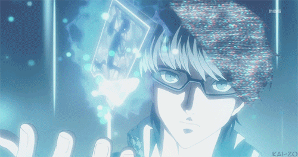
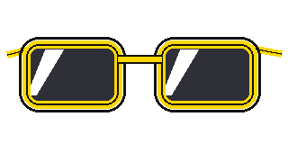
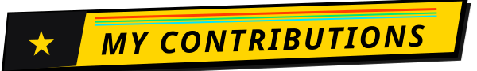

<!--
    Persona 4 Golden Profile Theme
    Developed for: Putu Pasek Jade Aurestha (KenKalahOprec)
    Layout structure adapted from Glauedson/Glauedson
-->

<!-- Banner Persona 4 Golden -->

  <a href="https://api.github-star-counter.workers.dev/user/KenKalahOprec">
     
  </a>
  <a href="https://github.com/KenKalahOprec?tab=repositories">
     
  </a>
  

 

<!-- Who am I? -->

## **⚡ Who Am I?**

I am **Putu Pasek Jade Aurestha (KenKalahOprec)**, an **Information Technology Student at Universitas Udayana**, Bali 🌴. Driven by relentless curiosity, I architect high-performance **fullstack web applications**, solve complex computational bottlenecks, and engineer production-grade **computer vision & machine learning** pipelines.

Like reaching out to the truth in the Midnight Channel, my engineering journey revolves around **cutting through the fog of bugs and complexity** to deliver sleek, battle-ready software. From building reactive desktop studios for **spatial matrix processing & digital image manipulation** (`OpenCV`, `NumPy`, `Python`) to designing ultra-fluid web systems with **modern web frameworks** (`React 19`, `Tailwind CSS v4`, `Next.js`), I turn ambitious concepts into reality with clean architecture.

Beyond coding solo, I serve as **Infrastructure Staff at Technology Artisan (Tecart)**, managing server uptime and automated deployment pipelines, while competing in algorithmic problem-solving arenas. Always learning, always overclocked, and always ready to ship software at lightspeed!

 
 

<!-- Connect with me badges -->

  <strong>📺 Connect With Me // Investigation Links</strong>
    

  <!-- GitHub -->
  
  <!-- Linkedin -->
  
  <!-- Instagram -->
  
  <!-- Pinterest -->
  
  <!-- GMail  -->
  

 

> [!IMPORTANT]
>
> **"Reach Out To The Truth"** — Code is never finished, it only gets **sharper**.
>
> Don your glasses, cut through the fog of bugs, and build with **relentless curiosity**, **discipline**, and **persistence**.

 

<!-- My contributions title -->

  
    

 

<!-- Contribution Matrix Snake -->

  <picture>
    <source media="(prefers-color-scheme: dark)" srcset="./assets/github-contribution-grid-snake-dark.svg">
    <source media="(prefers-color-scheme: light)" srcset="./assets/github-contribution-grid-snake.svg">
    
  </picture>

 

<table align="center" width="100%">
  <tr>
    <!-- Skills Left -->
    <td valign="top" width="45%">
      
        
       
       
       
       
    </td>
    <!-- Real Pushed Repos & Streak Right -->
    <td valign="top" width="55%">
      
        
      
        
      
    </td>
  </tr>
</table>

 

 

  
<b>⚡ Reach Out To The Truth • Powered by Persona 4 Golden Engine 📺</b>

  
<i>Built with pure passion, high-octane code & Bali sunshine 🌴</i>

   
  
© 2026 <b>Jade Aurestha</b>. All rights reserved.

